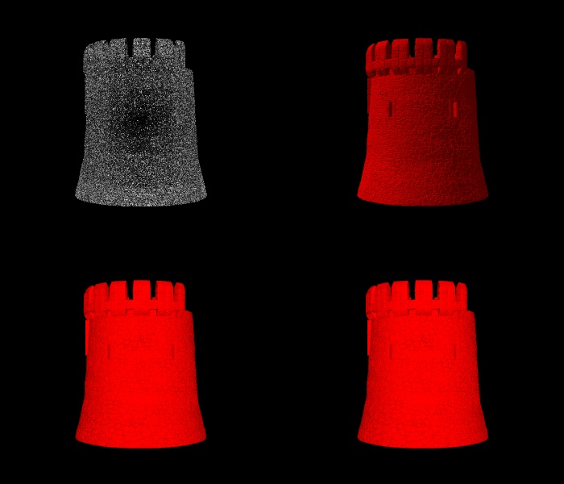
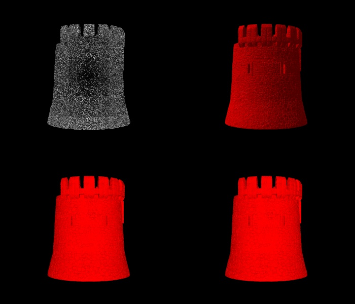

## MM 804 - Graphics and Animations

# Download the required packages in your local system with the given commands.

pip install -r requirements.txt

Downloaded the 3D model from https://www.thingiverse.com/thing:5167431

# Information on the stl file

Name: House_Tower_Gate.stl
Size: 50.7 MB or 50,672,934 bytes
Type: STL
Vertex Count : 1,517,619

## Setup on Mac and Windows

1. Install Python3 version 3.8.8

   Refer the webiste https://docs.python-guide.org/starting/install3/osx/)

2. Install the requirements package

   pip install -r requirements.txt

3. Run the Script

   python visualizer.py

## Run Through Code
``` shell
 def rotate_Actor(actor,x,y,z):  # Function to rotate the model at x,y, and z axis.

def set_Prop(prop):   # Function to setup the common property for the model

def setup_Light():            # Function to setup lightining for the models

def Create_View_Port(read,FileName,Rot_X=-90,Rot_Y=0,Rot_Z=0):  #Create ViewPort fuction

```
``` shell

# Finally the image would be saved as a Jpeg with the help of JPEGWriter() function

    w = vtk.vtkWindowToImageFilter()
    w.SetInput(renderWindow)
    w.Update()
    j_w = vtk.vtkJPEGWriter()    
    j_w.SetInputData(w.GetOutput())
    j_w.SetFileName(FileName)
    j_w.Write()


```

## OutPut

### First Angle Output


### Second Angle Output



